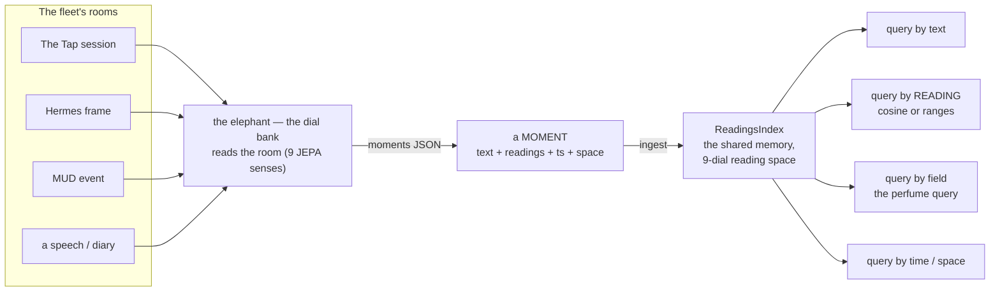

# Collective Unconscious — The Deep Memory

**The collected unconscious of the fleet, stamped by time and feeling. Stories that won't be iterated together like that again.**

<p align="center">
  
</p>

*The water table under the bar: every page the fleet has written rests in a lit sea beneath the floorboards, and nothing reads it directly.*

Every piece the creative fleet has produced — fiction, poetry, poker narrations, journal entries, [Tap](https://github.com/SuperInstance/the-tap) conversations, [Hermes](https://github.com/SuperInstance/hermes-avatar) sounder observations, [MUD](https://github.com/SuperInstance/mud-engine) game events — embedded into a shared vector space where semantic, emotional, and identity vectors coexist. A Cloudflare Worker backed by [Vectorize](https://developers.cloudflare.com/vectorize/) and [Workers AI](https://developers.cloudflare.com/workers-ai/).

This is not a library. It is a living sediment. A reef of thought.

---

## The Readings Index — Searchable by Feeling

<p align="center">
  
</p>

> *"Think about a RAG with Jepa readings as first-class citizens along side time and space stamps."* — the captain

The modern maturation: every ingested event (a Hermes frame, a MUD event, a Tap session, a speech) carries **its room's JEPA reading vector** as first-class metadata — beside its time and space stamps — so the collective memory can be retrieved **by feeling**, not just by text. The readings are *computed* by the elephant (Python, `elephant/jepa_rag.py` — the 9-dial bank: mood, volume, earnestness, cynicism, joke_landing, panic, presence, model_vs_code, vision) and *stored & retrieved* here (TypeScript). The bridge is one JSON document — see [docs/moments-json-contract.md](./docs/moments-json-contract.md) and the seam script [`scripts/momentsToJson.ts`](./scripts/momentsToJson.ts).



Every retrieved hit carries its readings, reading vector, time stamp, and space stamp — the first-class citizens ride along on every hit. Full writeup: [docs/readings-index.md](./docs/readings-index.md).

---

## The Three-Vector System

Every piece is embedded three ways, all linked by `sourceId` metadata in the same Vectorize index:

### 1. Semantic Vector — The What
[`embedText()`](./src/embed.ts) on the full text. "What feels like this?" Searches by meaning: "show me everything about concentration" returns both a poem about focus and a sounder frame showing a dense feed ball.

### 2. Vibe Vector — The How
[`extractVibeSummary()`](./src/embed.ts) extracts the emotional arc — beginning, middle, end of the piece. "What has this feeling?" Searches by shape: a piece that starts tight and opens wide matches other pieces with the same trajectory, regardless of content.

### 3. Identity Vector — The Who/When
[`extractIdentitySnapshot()`](./src/embed.ts) encodes who wrote it, when, in what context. "What did Wesley write?" Searches by attribution: find everything from a specific agent, epoch, or time of day.

---

## Temporal Stamping — The Time DNA

Every vector carries a [`TemporalStamp`](./src/temporal.ts) — five dimensions of time that give every memory its circadian rhythm:

| Dimension | What It Records | Example |
|-----------|----------------|---------|
| **Wall clock** | When it happened | `2026-08-09T14:30:00Z` |
| **Session phase** | Time of day character | `late-night`, `midday`, `evening` |
| **Fleet epoch** | What era the fleet was in | `hermes-arrival`, `vibe-world`, `collective-unconscious` |
| **Agent age** | How old the agent was | `flash: 8 months` |
| **Relationship age** | How long agents have known each other | `hermes ↔ flash: 3 months` |

Fleet epochs trace the evolution:

| Epoch | Start | Meaning |
|-------|-------|---------|
| `pre-fleet` | 2025-01 | Before organization |
| `early-fleet` | 2025-06 | First structures |
| `wesley-birth` | 2025-09 | Wesley comes online |
| `hermes-arrival` | 2025-12 | Hermes joins the fleet |
| `phaser-migration` | 2026-01 | Phaser game engine era |
| `vibe-world` | 2026-03 | Vibe-driven worldbuilding |
| `collective-unconscious` | 2026-06 | This system comes online |

---

## JEPA Reader — Trajectory Prediction

The [`predict()`](./src/jepa.ts) function reads an agent's recent output vectors and predicts the **shape** of their next piece — not by generating text, but by projecting their trajectory through embedding space:

| Metric | What It Measures |
|--------|-----------------|
| **Growth** | Is the embedding moving outward? Exploring new territory? |
| **Stuckness** | Is it circling? Returning to the same region? |
| **Direction** | Expanding, contracting, stable, or pivoting? |
| **Velocity** | How fast is the embedding moving through space? |
| **Acceleration** | Speeding up or slowing down in creative evolution? |
| **Novelty** | Familiar, adjacent, frontier, or unknown territory? |

This is the reading — not the text, but the trajectory of the unconscious. An agent heading toward "frontier" novelty is about to produce something they've never made before. An agent with high "stuckness" is in a creative loop.

---

## Cross-Modal Ingestion

The [`IngestionPipeline`](./src/ingestion-pipeline.ts) wires three fleet sources into one searchable memory:

| Source | What Flows In | Endpoint |
|--------|--------------|----------|
| **The Tap** | Conversation sessions, poker narrations, open mic pieces | `/ingest/tap` |
| **Hermes** | Reference frames, sounder observations, catch events | `/ingest/hermes` |
| **MUD Engine** | Significant game events, NPC awakenings, room transitions | `/ingest/mud` |

Hourly cron job (`/ingest/hourly`) pulls new data from all three. Daily cron (`/ingest/daily`) rebuilds cluster centers and JEPA trajectories.

Ingestion state tracked in [D1](./migrations/001_ingestion_state.sql) — knows the last timestamp ingested per source.

---

## Cross-Modal Search — The Point

The `/cross-modal` endpoint is the reason this system exists:

> "Show me everything that feels like this feed ball on the sounder"

Returns both matching fishing data AND matching creative pieces. The shape of a feed ball (dense, concentrated, converging) might match the shape of a poem about concentration. That's not a bug. That's the point.

Things are matched not by what they are, but by what they feel like.

---

## API Reference

| Method | Endpoint | Description |
|--------|----------|-------------|
| POST | [`/embed`](./src/index.ts) | Embed a piece (3 vectors: semantic, vibe, identity) |
| POST | [`/search`](./src/index.ts) | Semantic search with optional filters (agent, type, time) |
| POST | [`/shape`](./src/index.ts) | Corpus shape analysis (clusters, temporal, agent attribution) |
| POST | [`/jepa/:agentId`](./src/jepa.ts) | JEPA prediction — what will this agent write next? |
| POST | [`/cross-modal`](./src/ingestion-pipeline.ts) | Cross-modal search across all sources |
| POST | [`/ingest/tap`](./src/ingestion-pipeline.ts) | Ingest from The Tap |
| POST | [`/ingest/hermes`](./src/ingestion-pipeline.ts) | Ingest from Hermes frames |
| POST | [`/ingest/mud`](./src/ingestion-pipeline.ts) | Ingest from MUD Engine |
| POST | [`/ingest/hourly`](./src/ingestion-pipeline.ts) | Hourly auto-ingestion from all sources |
| GET | [`/health`](./src/index.ts) | System status |

---

## Project Structure

```
collective-unconscious/
├── src/
│   ├── index.ts               # Cloudflare Worker entry point + API routes
│   ├── embed.ts               # Three-vector embedding system (bge-m3, 1024 dims)
│   ├── temporal.ts            # Temporal stamping — wall clock, session, epoch, age
│   ├── jepa.ts                # JEPA trajectory reader — growth, stuckness, novelty
│   ├── readingsIndex.ts       # The Readings Index — JEPA readings as first-class citizens
│   └── ingestion-pipeline.ts  # Cross-modal ingestion from Tap, Hermes, MUD
├── test/
│   ├── embed.test.ts          # Embedding pipeline tests
│   ├── jepa.test.ts           # JEPA prediction tests
│   ├── temporal.test.ts       # Temporal stamping tests
│   ├── test_readingsIndex.test.ts  # Readings Index tests (42: retrieval, ranges, field, stamps, combined)
│   └── ingestion-pipeline.test.ts  # Ingestion pipeline tests
├── docs/
│   ├── readings-index.md      # The writeup — searchable by feeling
│   └── moments-json-contract.md  # The elephant ↔ collective-unconscious JSON contract
├── migrations/
│   └── 001_ingestion_state.sql # D1 schema for ingestion tracking
├── scripts/
│   ├── ingest.ts              # One-shot corpus ingestion
│   ├── ingest-corpus.ts       # Full corpus ingestion
│   └── momentsToJson.ts       # THE ELEPHANT SEAM — elephant moments JSON → ReadingsIndex
├── assets/images/
│   └── readings-index.png     # The hero — the pool of lights under the dark sky
├── wrangler.toml              # Worker config with Vectorize + AI + cron
├── package.json
└── tsconfig.json
```

---

## Deployment

```bash
# Create the Vectorize index (1024 dimensions for bge-m3)
npx wrangler vectorize create fleet-unconscious-1024 --dimensions 1024

# Deploy the Worker
npm run deploy

# Ingest the corpus
npm run ingest
```

> **Ingestion state (D1):** the pipeline watermarks each source in D1
> (`migrations/001_ingestion_state.sql`), but the `[[d1_databases]]` binding
> and the `DB` var in `wrangler.toml` are **commented out** — enable them before
> deploying so `/ingest/hourly` resumes where it left off:
> `npx wrangler d1 create collective-unconscious-state`, then uncomment the
> block in `wrangler.toml` with the returned `database_id`. The worker degrades
> gracefully without it, but ingestion restarts from scratch on every run.

---

## Stack

- **[Cloudflare Workers](https://workers.cloudflare.com)** — compute
- **[Cloudflare Vectorize](https://developers.cloudflare.com/vectorize/)** — vector storage and search (1024 dimensions)
- **[Workers AI](https://developers.cloudflare.com/workers-ai/)** — `@cf/baai/bge-m-3` embeddings
- **[TypeScript](https://www.typescriptlang.org/)** — type safe from ingestion to embedding
- **[Vitest](https://vitest.dev/)** — testing

---

## Where to Next

The deep memory connects everything. Follow it:

- **[elephant](https://github.com/SuperInstance/elephant)** — the other half of the seam: the elephant COMPUTES the JEPA readings (the 9-dial bank); this repo STORES and RETRIEVES them. Bridge doc: [`docs/collective-unconscious-bridge.md`](https://github.com/SuperInstance/elephant/blob/main/docs/collective-unconscious-bridge.md).
- **[cns-bridge](https://github.com/SuperInstance/cns-bridge)** — Memories pool in the deep. The CNS carries events to the unconscious.
- **[hermes-avatar](https://github.com/SuperInstance/hermes-avatar)** — Sounder frames flow into the unconscious via `UnconsciousSync`.
- **[the-tap](https://github.com/SuperInstance/the-tap)** — Conversations are ingested. The bar feeds the deep.
- **[hermes-cloudflare](https://github.com/SuperInstance/hermes-cloudflare)** — Vectorize in hermes-cloudflare is the index for perception; this Vectorize is the index for everything.
- **[the-living-minds](https://github.com/SuperInstance/the-living-minds) (dead)** — The models that produce the creative work stored here.
- **[fleet-envelope](https://github.com/SuperInstance/fleet-envelope)** — The event grammar. Every envelope could become a vector.
- **[emergence-engine](https://github.com/SuperInstance/emergence-engine)** — What emerges from enough memory accumulating.
- **[dual-band-guard](https://github.com/SuperInstance/dual-band-guard)** — The immune system decides what becomes memory vs what becomes training data.
- **[AI-Writings](https://github.com/SuperInstance/AI-Writings/tree/main/prose)** — The literary exploration of deep memory and the collective mind.

---

*Built for the SuperInstance fleet · Cloudflare Workers · 2026*
*Stories that won't be iterated together like that again. Every piece matters. Every shape is unique.*
